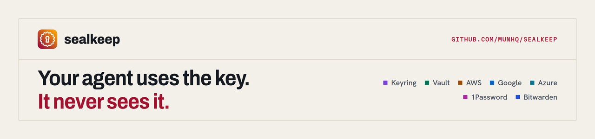

<p align="center"></p>

<p align="center">
  <a href="https://www.npmjs.com/package/@munhq/sealkeep"></a>
  <a href="https://registry.modelcontextprotocol.io/v0/servers?search=io.github.munhq/sealkeep"></a>
  <a href="https://github.com/munhq/sealkeep/actions/workflows/ci.yml"></a>
  <a href="https://smithery.ai/servers/munhq/sealkeep"></a>
  <a href="LICENSE"></a>
</p>

<p align="center">
  <a href="cursor://anysphere.cursor-deeplink/mcp/install?name=sealkeep&config=eyJjb21tYW5kIjoibnB4IiwiYXJncyI6WyIteSIsIkBtdW5ocS9zZWFsa2VlcCJdfQ=="></a>
  <a href="vscode:mcp/install?%7B%22name%22%3A%22sealkeep%22%2C%22command%22%3A%22npx%22%2C%22args%22%3A%5B%22-y%22%2C%22%40munhq%2Fsealkeep%22%5D%7D"></a>
</p>

# sealkeep

sealkeep lets an AI agent use your secrets without seeing them.

You keep each secret one time, under a name such as `shared/stripe/test/SECRET_KEY`. The agent finds the name with `sealkeep list`, and runs a command with it. It never reads the value, and it never has to ask you for one.

The agent asks for a secret by its name. sealkeep puts the value into the environment of one command, runs the command, and replaces the value with `[sealkeep:NAME]` in all the output. The value does not go into the context, the transcript or a file.

```
agent ──► sealkeep run OPENROUTER_API_KEY -- sh -c 'curl -H "Authorization: Bearer $OPENROUTER_API_KEY" …'
              │
              ├─ reads the value from a store ──► OS keyring  (macOS Keychain, Secret Service, Windows Credential Manager)
              │                               └─► Vault KV v2 (a replica)
              ├─ starts the command with the value in its environment
              └─ redacts the value from stdout and stderr ──► agent sees [sealkeep:OPENROUTER_API_KEY]
```

It has four parts:

1. **A CLI** (`sealkeep`): `set`, `list`, `run`, `import`, `scan`, `sync`, aliases and the store commands.
2. **An MCP server** (`sealkeep mcp`): the tools `list_secrets`, `run_with_secrets` and `store_status`. No tool returns a value.
3. **A guard hook** (`sealkeep guard`): it refuses the tool calls that would print a secret, for example `cat .env` or `sealkeep get`.
4. **A skill** that tells the agent when and how to use the CLI.

## Install

As an MCP server only (any client), the command is `npx -y @munhq/sealkeep`:

```json
{ "mcpServers": { "sealkeep": { "command": "npx", "args": ["-y", "@munhq/sealkeep"] } } }
```

In Claude Code, the plugin adds the MCP server, the skill and the guard hook in one step:

```
/plugin marketplace add munhq/sealkeep
/plugin install sealkeep@sealkeep
```

The full install below does the same for Claude Code, Codex and Cursor.

Linux and macOS:

```sh
curl -fsSL https://raw.githubusercontent.com/munhq/sealkeep/main/install.sh | sh
```

The script downloads the binary of the newest release, checks it against `SHA256SUMS`, copies it to `~/.local/bin`, and runs `sealkeep install`.

With Rust:

```sh
cargo install --locked --git https://github.com/munhq/sealkeep
sealkeep install
```

`sealkeep install` finds the AI clients on the machine. It adds the skill, the MCP server and the guard hook to each client:

| Client | Skill | MCP server | Guard hook |
|---|---|---|---|
| Claude Code (each config folder) | `<config>/skills/sealkeep` | `claude mcp add --scope user` | `<config>/settings.json`, PreToolUse on `Bash`, `Read`, `Grep` |
| Codex | `$CODEX_HOME/skills/sealkeep` | `codex mcp add` | `$CODEX_HOME/hooks.json`, PreToolUse (approve it one time with `/hooks`) |
| Cursor | `~/.cursor/skills/sealkeep` | `~/.cursor/mcp.json` | `~/.cursor/hooks.json`, beforeShellExecution |

Options: `--client claude,codex` installs into the named clients only. `--dry-run` shows the plan. `--no-skills`, `--no-mcp` and `--no-hooks` leave out a part. Before sealkeep changes a JSON file, it writes a backup (`<file>.bak-<unix time>`). `sealkeep uninstall` removes what `install` added.

Run `sealkeep doctor` to check the stores and the clients.

## Names

A name is `<scope>/<project>/<env>/<KEY>`:

| Part | Values | Example |
|---|---|---|
| scope | Who owns the secret: `personal`, the name of an employer or a client, or `shared` for one account that several scopes use | `personal`, `acme`, `shared` |
| project | The repository or the service | `example-app`, `stripe`, `ovh` |
| env | `prod`, `dev`, `test`, `local`. Leave it out when the secret has no environment (the API key of an account) | `prod` |
| KEY | The environment variable that the program reads | `DATABASE_URL` |

Folders are lower case (`a-z`, `0-9`, `.`, `_`, `-`). The key is upper case (`A-Z`, `0-9`, `_`) and is the variable that `run` sets.

```
personal/example-app/prod/DATABASE_URL
personal/example-app/dev/DATABASE_URL
personal/example-app/dev/STRIPE_SECRET_KEY   -> shared/stripe/test/SECRET_KEY   (alias)
acme/ovh/ovh-eu/APPLICATION_KEY
acme/cloudflare/API_TOKEN
shared/stripe/test/SECRET_KEY
shared/openrouter/API_KEY
```

**One value, one name.** When two projects use the same account, store the value one time under `shared/…`, and make an alias in each project folder. The project folder then has every variable that the project needs, and a rotation changes one value.


### Store a secret

```sh
sealkeep set shared/openrouter/API_KEY -d "OpenRouter, the main account"   # writes to every store
```

sealkeep asks for the value two times, with no echo. To pipe a value in, use `--stdin`:

```sh
some-password-tool show openrouter | sealkeep set shared/openrouter/API_KEY --stdin
```


To find the secrets on a machine, run `scan`. It prints the path of each `.env` file, its key names, a class for each key (`secret`, `config` or `empty`), and a group number for each value that is in more than one place. It never prints a value. It also lists other files that often hold a credential, by path only:

```sh
sealkeep scan ~/code --max-depth 4
```

To copy a file into a folder:

```sh
sealkeep import ../example-app/.env --to personal/example-app/dev \
  --map STRIPE_SECRET_KEY=shared/stripe/test/SECRET_KEY
sealkeep import ~/.ovh.conf --to acme/ovh            # INI: one folder for each section
sealkeep set personal/github/PAT --from-file ~/.github-token
```

`import` reads dotenv files, and INI files (`.ini`, `.conf`, AWS `credentials`). It prints the names only. `--map KEY=NAME` stores the value at NAME and makes the project key an alias of it. If NAME already has a different value, `import` stops and says so. After the import, delete the source file, or keep it out of the reach of the agent.

### Let the agent use it

Tell the agent what to do. The skill tells it to run `sealkeep list` for the names, and `sealkeep run` for the command:

```sh
sealkeep run shared/openrouter/API_KEY -- sh -c 'curl -sS -H "Authorization: Bearer $API_KEY" https://openrouter.ai/api/v1/key'
sealkeep run --all personal/example-app/dev -- npm run dev
sealkeep run -e GITHUB_TOKEN=personal/github/PAT -- gh api user
```

A name sets the variable named by its key. `--all FOLDER` sets one variable for each secret in the folder, the same as a `.env` file. `--recursive` also takes the subfolders; two secrets with the same key are then an error. `-e VAR=NAME` sets a variable with a different name. `STORE:NAME` reads from one store only.

For a tool that reads its secrets from a file, `--dotenv` writes a temporary file that only you can read. The file is in `$XDG_RUNTIME_DIR/sealkeep` when it exists. sealkeep puts the path where the command has `{dotenv}`, and it removes the file when the command ends. This example gives Playwright MCP the login of a test account. The agent types the name `ADMIN_PASSWORD`, and Playwright puts in the value:

```sh
sealkeep run --dotenv personal/example-app/dev/ADMIN_EMAIL --dotenv personal/example-app/dev/ADMIN_PASSWORD \
  -- npx @playwright/mcp@latest --secrets {dotenv}
```

`--secrets <path>` is an option of `@playwright/mcp` (see its README).

### See a value yourself

```sh
sealkeep get shared/openrouter/API_KEY
```

`get` works only when stdin and stdout are a terminal. An agent runs commands without a terminal, so `get` refuses, and the guard hook also refuses it.

## Stores

sealkeep looks up a bare name in the stores in the order of the config file. The first store that has the name gives the value.

The config file is `~/.config/sealkeep/config.toml` on Linux and `~/Library/Application Support/sealkeep/config.toml` on macOS. `$SEALKEEP_CONFIG` sets another path. With no file, sealkeep has one keyring store named `local`.

```toml
[[store]]
name = "local"
kind = "keyring"

[[store]]
name = "vault"
kind = "vault"
address = "http://127.0.0.1:{port}"
mount = "agent"
auth = "kubernetes"
role = "sealkeep"
jwt_command = ["kubectl", "-n", "vault", "create", "token", "sealkeep", "--duration", "10m"]
port_forward = ["kubectl", "-n", "vault", "port-forward", "svc/vault", "{port}:8200"]

[aliases]
"personal/example-app/dev/STRIPE_SECRET_KEY" = "shared/stripe/test/SECRET_KEY"

[guard]
block_dotenv = true
deny = ["vault kv get", "ansible-vault view"]
```

### The OS keyring

| OS | Store |
|---|---|
| macOS | the login Keychain |
| Linux, BSD | the Secret Service (GNOME Keyring, KWallet) on the session D-Bus |
| Windows | the Credential Manager |

Each secret is one entry with the service `sealkeep` and the secret name as the account. An index entry (`__index__`) keeps the names and the descriptions.

On Linux, the keyring must be unlocked. A desktop session unlocks it when you log in. A session with no desktop (SSH, a login with no keyring password) has a locked keyring, and no unlock prompt can show. Run this one time after each boot:

```sh
sealkeep unlock
```

It asks for the password of the login keyring and gives it to `gnome-keyring-daemon --unlock`. Each keyring call waits at most 30 seconds (`SEALKEEP_KEYRING_TIMEOUT`), so an agent gets an error, and the call does not hang.

### Vault as a replica

A Vault (or OpenBao) KV v2 mount can hold a copy of the keyring, for a second machine or a backup. Each folder is one KV secret, and each key is one field of it: `shared/stripe/test/SECRET_KEY` is the field `SECRET_KEY` of `agent/shared/stripe/test`. The `custom_metadata` of each secret lists its keys and their descriptions, so `list` reads no value.

For a Vault inside Kubernetes, sealkeep can reach it through the Kubernetes API with a port forward, and log in with a short-lived ServiceAccount token. The machine then keeps no Vault token:

```sh
sealkeep store add-vault vault \
  --address 'http://127.0.0.1:{port}' --mount agent --auth kubernetes --role sealkeep \
  --jwt-command 'kubectl -n vault create token sealkeep --duration 10m' \
  --port-forward 'kubectl -n vault port-forward svc/vault {port}:8200'
sealkeep sync --from local --to vault   # one time, for the secrets that are already in the keyring
```

`set`, `import` and `mv` write to every store (a Vault store takes only names with a folder), so the stores stay the same. `--store NAME` writes to one store. The Vault side needs a KV v2 mount, a policy with `create`, `read` and `update` on `agent/data/*` and `read`, `list` and `update` on `agent/metadata/*`, and a Kubernetes auth role bound to the ServiceAccount. With `--auth token`, sealkeep reads `$VAULT_TOKEN`, or the token that `sealkeep store token vault` keeps in the keyring.

### Other secret managers

Each of these is a store kind. It runs the official CLI of the vendor, so the vendor's own sign-in (SSO, a service account, biometrics) applies, and sealkeep keeps no vendor token. A value goes to the CLI through stdin or through a file that only you can read, never as a command argument, which `ps` would show.

| Store | Add it | Layout | The value goes in through |
|---|---|---|---|
| AWS Secrets Manager | `sealkeep store add-aws aws --region eu-west-1` | One JSON secret for each folder, `sealkeep/<folder>` | `--secret-string file://…` |
| Google Secret Manager | `sealkeep store add-gcp gcp --project acme-prod` | One secret for each name; annotations hold the name | `--data-file=-` (stdin) |
| Azure Key Vault | `sealkeep store add-azure azure --vault acme-kv` | One secret for each name; tags hold the name | `--file …` |
| 1Password (CLI 2.23+) | `sealkeep store add-1password op --vault Engineering` | One Secure Note for each folder, one concealed field for each key | the item JSON on stdin |
| Bitwarden / Vaultwarden | `sealkeep store add-bitwarden bw` | One Secure Note `sealkeep:<folder>`, one hidden field for each key | the item JSON on stdin |
| OpenBao | `sealkeep store add-vault …` | as Vault | as Vault |

Google and Azure allow only some characters in a secret ID, so the ID is the name with `/` as `--` and a short hash, and the real name is in an annotation or a tag. Azure keeps a removed secret in its soft-delete state, and a later `set` of the same name recovers it. For Bitwarden, unlock first: `export BW_SESSION=$(bw unlock --raw)`. The Bitwarden Secrets Manager CLI (`bws`) takes a value only as a command argument, so sealkeep uses the password manager CLI (`bw`).

## SSH keys

An SSH agent holds a key with a passphrase only in memory. After a reboot it is empty, and an agent's `git push` fails with `Permission denied (publickey)`. sealkeep keeps the passphrase and loads the key:

```sh
sealkeep set personal/ssh/ID_ED25519_PASSPHRASE
sealkeep ssh-add ~/.ssh/id_ed25519 --passphrase personal/ssh/ID_ED25519_PASSPHRASE
sealkeep ssh-load      # unlock runs it too
```

`ssh-load` runs `ssh-add` with sealkeep as the `SSH_ASKPASS` program. The askpass step answers only when its parent process is `ssh-add` and a one-use token matches, and it reads the passphrase from the store, so the passphrase never goes to a file or the output. `--agent` picks the agent socket; the default is `$SSH_AUTH_SOCK`.

## MCP

`sealkeep mcp` serves these tools on stdio:

| Tool | What it does |
|---|---|
| `list_secrets` | The names, stores and descriptions, for all names or one `folder`. |
| `run_with_secrets` | Runs `command` (a list of arguments, with no shell) with `folders` and `secrets` in the environment and `dotenv` in a temporary file. Returns the exit code, stdout and stderr, redacted. The time limit is 120 s by default and 900 s at most. Each stream is cut at 100 KiB. |
| `store_status` | Whether each store can be used now. |

## The guard hook

The hook refuses these tool calls, and it tells the agent to use `sealkeep run`:

1. `sealkeep get`, also inside `$(…)`, backticks and `bash -c`.
2. A read of the sealkeep keyring entries: `secret-tool lookup service sealkeep …`, `security find-generic-password -s sealkeep … -w`, `keyring get sealkeep …`.
3. A read of a `.env` file by a shell command or by the Read and Grep tools, when `block_dotenv` is on. `.env.example`, `.env.sample`, `.env.template` and `.env.dist` stay readable.
4. Each command prefix in `guard.deny`.

## What sealkeep protects, and what it does not

sealkeep keeps secrets out of the context of the agent, out of the transcript and out of the files of the project. Each use goes into the audit log (`~/.local/share/sealkeep/audit.jsonl` on Linux, or `$SEALKEEP_AUDIT_LOG`), with the names and the command and never a value.

Redaction matches the value, its JSON-escaped form, its percent-encoded form and its base64 forms. A value is redacted when its key looks like a secret (`KEY`, `TOKEN`, `SECRET`, `PASS`, `AUTH` and similar words), when it is a URL with a password, or when it has 16 characters or more. A config value such as `PORT=3000` stays readable. A value that is shorter than 4 characters is not redacted. A command that transforms a value in another way (for example, a hash or a part of the value) can print it in a form that sealkeep does not match.

An agent that can run any shell command as your user can read what your user can read. sealkeep does not change that. It makes the safe path the easy one, it refuses the common paths to a value, and it records each use. Give an agent keys with a small scope: a restricted Stripe key, an OpenRouter key with a spend limit, a test account for a web login.

## Build and test

```sh
cargo build --release
cargo test --features test-store
```

The `test-store` feature replaces the OS keyring with a file, for the tests only. The release binaries are built without it.

## Licence

MIT
